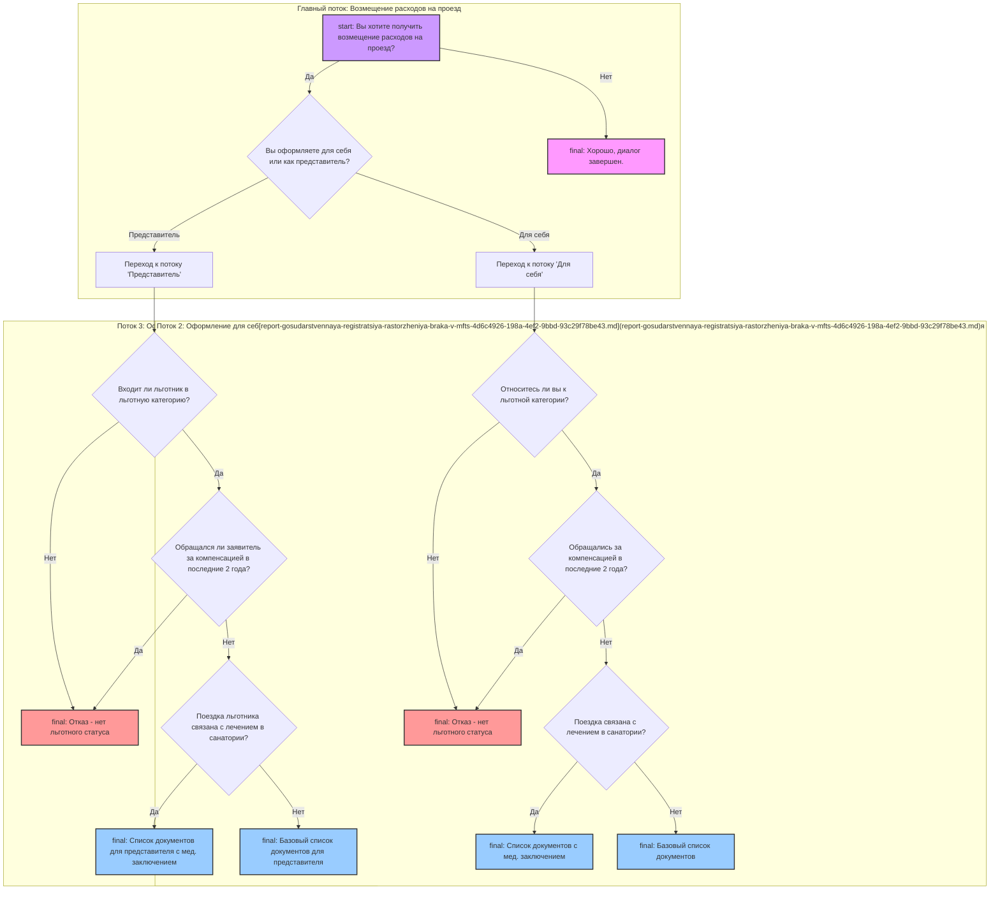

# snake-game
### Classic game in my interpretation

A simple game in which you have to feed the snake food.
Each element eaten lengthens the snake and earns one point.
The scores are stored in a separate file so that after a loss
(collision with window borders or snake body) the previous record is available.

### Screenshot from the game:

### Technologies:
- Python 3;
- modules: Turtle, Time, Random.

### You can run this project locally just do:
- `git clone https://github.com/slychagin/snake-game.git`;
- you must have Python 3 installed on your computer;
- make sure that the directory for the python bin/folder are included in your $PATH environment variable;
- `cd snake-game`;
- `python main.py`.

